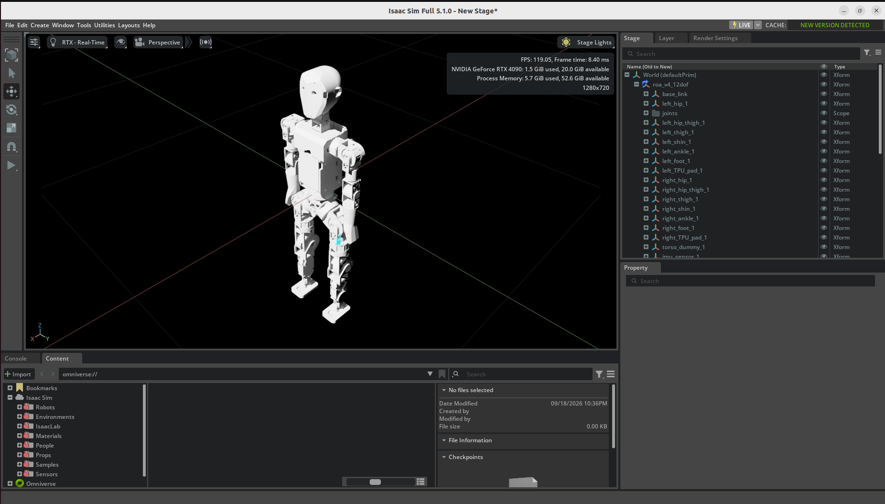

# ROA v4 12-DOF USD

USD assets for the **ROA v4 12-DOF humanoid robot**, prepared for use with NVIDIA Isaac Sim and Isaac Lab.

The main stage is [`roa_v4_12dof.usd`](roa_v4_12dof.usd). Its setup is divided into reusable layers under `configuration/`:

- `roa_v4_12dof_base.usd` — base geometry and structure
- `roa_v4_12dof_robot.usd` — robot joints and articulation
- `roa_v4_12dof_physics.usd` — physics properties
- `roa_v4_12dof_sensor.usd` — sensor configuration

Open `roa_v4_12dof.usd` in Isaac Sim to view or use the complete robot model.
